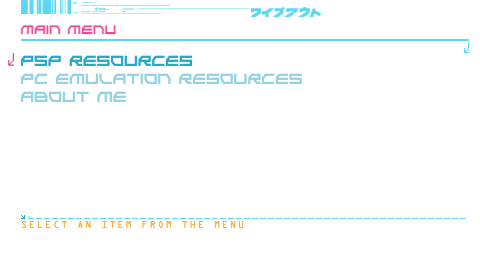

# wipeout-pure-site

<center></center>

## Development

### If you have `bun` installed...

Simply run `./start-playground.sh` to quickly whip up a development server.

Alternatively, run the following commands:

```sh
bun install -g http-server
bunx http-server -c-1
```

### If you don't have `bun` installed but have `node`

```sh
sudo npm i -g http-server
npx http-server -c-1
```

### If you don't have node

Simply opening `index.html` will do, but I will not provide support for it. Some
features of the site may not work in the future...